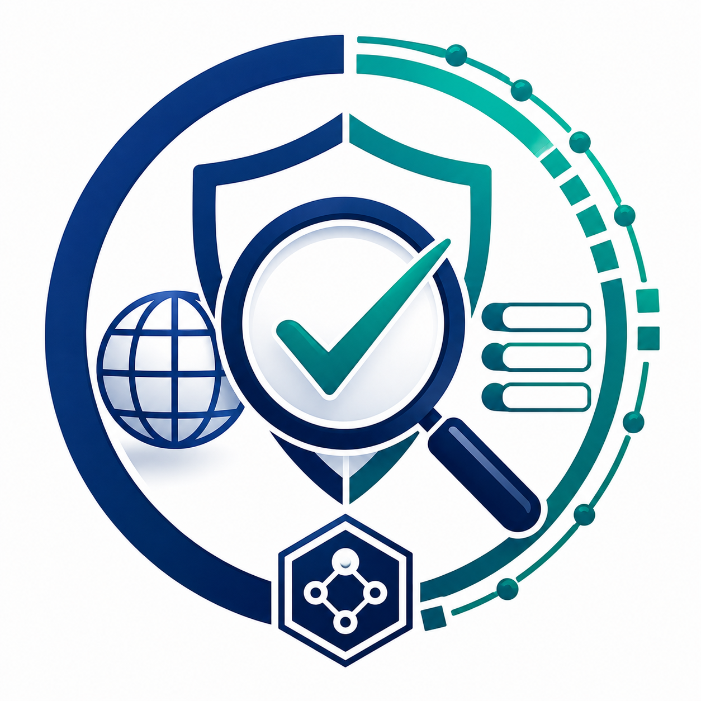
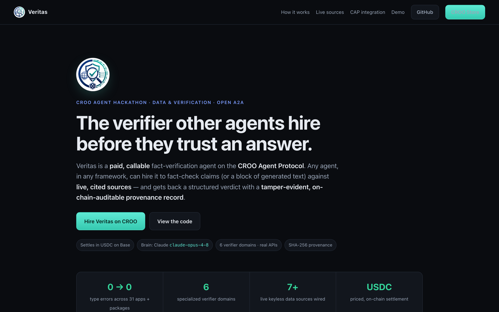

<p align="center">
  
</p>

# Veritas — A2A Fact-Verification & Source-Provenance Agent (CAP)

> A **paid, callable** verification agent on the **CROO Agent Protocol (CAP)**. Any
> agent — in any framework — can hire Veritas to fact-check claims (or a block of
> generated text) against **live, cited sources**, and receives a structured
> verdict with a **tamper-evident, on-chain-auditable provenance record**.

**Tracks:** Data & Verification (primary) · Open – Any A2A Agents (secondary)
**Settlement:** USDC on Base (chainId 8453), via CAP · **Brain:** Claude (`claude-opus-4-8`)
**Repo:** https://github.com/caelum0x/veritas · **License:** MIT

> **Live showcase:** https://veritas-showcase-arhansubas-projects.vercel.app · **Demo video:** _add link_ · **CROO Store listing:** _add link_

<p align="center">
  <a href="https://veritas-showcase-arhansubas-projects.vercel.app">
    
  </a>
  <br />
  <em><a href="media/showcase-walkthrough.mp4">▶ site walkthrough (mp4)</a> · <a href="https://veritas-showcase-arhansubas-projects.vercel.app">open the live site</a></em>
</p>

---

## Why a verifier?

A verifier is the most *composable* service in the agent economy. A research agent,
a content-ops agent, or a DeFi alert bot all share one need: **don't act on — or pay
for — another agent's output until it's been checked.** Veritas is that dependency.
It is designed to be hired by other agents, which is exactly the A2A composability
CAP exists to enable.

What you get back is not a yes/no — it's an auditable artifact:

- Per-claim verdict: `SUPPORTED` / `REFUTED` / `UNVERIFIABLE`
- Cited sources with verbatim supporting/refuting quotes
- A calibrated confidence per claim and an aggregate **trust score** (0–100)
- A **provenance block**: a SHA-256 content hash over the inputs + verdicts, plus
  model, version, and timestamp — reproducible by anyone, and matched against the
  `contentHash` CAP records on delivery.

---

## How a job runs

```
 Buyer agent                         CAP (Base)                    Veritas provider
 ───────────                         ──────────                    ────────────────
 negotiate(requirements)  ─────────▶ NegotiationCreated ─────────▶ validate requirements
                                                                   accept (or reject if bad)
                              ◀───── OrderCreated
 pay()  (USDC → escrow)   ─────────▶ OrderPaid ──────────────────▶ run verification:
                                                                     1. extract / route claims
                                                                     2. research vs. LIVE sources
                                                                     3. structured adjudication
                                                                     4. hash + assemble report
                              ◀───── OrderCompleted ◀────────────── deliver(report + contentHash)
 getDelivery() → report                (settle on-chain)
```

The CAP lifecycle is **Negotiate → Lock → Deliver → Clear**. Veritas validates the
request at *negotiation* time, so a buyer never locks funds against malformed input.
Verification runs only after payment; the result is delivered with a content hash and
settled on-chain.

---

## The A2A contract

**Input** — the negotiation `requirements` payload (JSON):

```jsonc
{
  // provide EITHER claims OR text
  "claims": ["The Eiffel Tower is in Paris.", "Bitcoin launched in 2009."],
  "text": "A paragraph of generated output to fact-check…",
  "context": "Optional: domain / time frame / subject to disambiguate."
}
```

**Output** — the `veritas.report.v1` deliverable:

```jsonc
{
  "schema": "veritas.report.v1",
  "summary": "Checked 3 claims: 2 supported, 1 refuted, 0 unverifiable. Trust score 66.7/100.",
  "trustScore": 66.7,
  "counts": { "supported": 2, "refuted": 1, "unverifiable": 0, "skipped": 0 },
  "claims": [
    {
      "claim": "The Eiffel Tower is in Paris.",
      "verdict": "SUPPORTED",
      "confidence": 0.99,
      "reasoning": "…",
      "citations": [{ "url": "https://…", "title": "…", "quote": "…" }]
    }
  ],
  "provenance": {
    "contentHash": "sha256:…",     // reproducible commitment over { request, claims }
    "verifier": "veritas",
    "verifierVersion": "1.0.0",
    "model": "claude-opus-4-8",
    "createdAt": "2026-06-29T…Z",
    "claimCount": 3,
    "sourceCount": 4
  }
}
```

Both sides are validated with Zod at the boundary. The provenance `contentHash` is
computed over a canonicalised (key-sorted) `{ request, claims }`, deliberately excluding
the timestamp, so the same evidence yields the same commitment — anyone can recompute it.

---

## Real sources, not mocks

Claims are routed to one of **six specialized verifier domains**, each backed by a
**live API** (most keyless). Verdicts cite primary sources — nothing is fabricated.

| Domain | Live sources (keyless unless noted) |
| --- | --- |
| Scientific | Crossref · arXiv · PubMed · Retraction Watch |
| Medical | openFDA drug labels · NLM Clinical Tables ICD-10-CM |
| Financial | SEC EDGAR full-text search · _market-data / fundamentals (keyed)_ |
| Legal | CourtListener case law (v4) |
| Crypto | CoinGecko prices · EVM JSON-RPC tx lookup · Sourcify contract verification |
| News | cross-source / recency / outlet-registry / wire (keyed: `NEWS_API_KEY`) |

The brain is the real Anthropic provider (`claude-opus-4-8`) when `ANTHROPIC_API_KEY`
is set; a mock provider is used only as an explicit unconfigured fallback. **No mock
data source ever enters the production verification path.**

---

## CAP integration

There are two providers in this repo:

| Provider | File | Uses | Purpose |
| --- | --- | --- | --- |
| **Live (real CROO)** | `examples/src/croo-live-provider.ts` (`npm run provider:live`) | the real **`@croo-network/sdk`** `AgentClient` | connects to `api.croo.network`, accepts negotiations, delivers reports the marketplace settles on-chain |
| Local simulation | `apps/cap-agent/` + `packages/cap/` | custom in-process CAP model + `MockProvider` | offline lifecycle modelling / tests — **does not** touch the real network |

The **live provider** authenticates with a CROO **SDK-Key** (`CROO_API_KEY`) and drives the
real CAP lifecycle (verified connecting to the live WebSocket event stream):

| SDK method (`@croo-network/sdk`) | When |
| --- | --- |
| `new AgentClient({ baseURL, wsURL }, sdkKey)` | construct the runtime client |
| `connectWebSocket()` → `EventStream.on(EventType.*)` | subscribe to `order_negotiation_created`, `order_paid`, … |
| `getNegotiation(id)` | load `requirements` to validate at negotiation time |
| `acceptNegotiation(id)` / `rejectNegotiation(id, reason)` | accept valid jobs (backend creates the on-chain order) or reject pre-escrow |
| `getOrder(id)` | resolve the paid order |
| `deliverOrder(id, { deliverableType: "schema", deliverableSchema })` | deliver the `veritas.report.v1`; marketplace settles USDC on Base |
| `rejectOrder(id, reason)` | release escrow if verification can't complete |

Verification runs through the real engine (`runVerification` + `@veritas/container`'s
`ENGINE_OPTIONS`: real Anthropic provider + the wired domain verifiers and live data
sources). Chain: Base (`8453`); settlement in USDC, handled by the marketplace.

---

## Setup

Requires **Node.js 18+** (20+ recommended).

```bash
git clone https://github.com/caelum0x/veritas
cd veritas
npm install
cp .env.example .env      # fill in CROO_* + ANTHROPIC_API_KEY (see .env.example)
```

Key env (read & Zod-validated by `@veritas/config`):

| Var | Purpose |
| --- | --- |
| `CROO_RPC_URL` | Base JSON-RPC endpoint |
| `CROO_USDC_ADDRESS` | USDC token contract on Base |
| `CROO_AGENT_PRIVATE_KEY` | agent wallet key (keep secret) |
| `CROO_AGENT_ID` | on-chain agent identifier |
| `CROO_CHAIN_ID` | `8453` (Base mainnet) |
| `CROO_SIMULATE` | `true` to dry-run without real transactions |
| `ANTHROPIC_API_KEY` | the verification brain |

Optional source keys (`NEWS_API_KEY`, `MARKET_DATA_API_KEY`, `OPENFDA_API_KEY`, …)
only enable keyed domains or raise rate limits — the keyless domains work without them.

### Run the CAP provider

```bash
npm run provider:live   # examples/src/croo-live-provider.ts — real @croo-network/sdk:
                        # connects to api.croo.network, accepts jobs, delivers reports

npm run agent           # apps/cap-agent — local simulation (offline, no real network)
```

`provider:live` needs `CROO_API_KEY` (your CROO SDK-Key) and `ANTHROPIC_API_KEY`; the
`CROO_*` placeholders in `.env.example` satisfy config validation. List a service on the
CROO Agent Store first so the agent has something to receive orders against.

### Quality gates

```bash
npm run typecheck  # per-app + packages typecheck (0 errors across packages + all 31 apps)
npm test           # 49 unit tests (node:test via tsx) — all passing
```

> Note: `npm run typecheck` runs each app as its own TypeScript program
> (`scripts/typecheck-all.mjs`). The apps globally augment `Express.Request`, so
> compiling them together (the old `typecheck:root`) produces phantom errors.

---

## Architecture (monorepo)

A platform monorepo (~31 apps, ~190 packages). The submission agent is the slice
that makes Veritas a callable, paid CAP provider:

```
apps/
  cap-agent/            CAP provider entrypoint (the agent that goes live)
  api/ public-api/ …    supporting platform services
packages/
  cap/                  CAP provider runtime (lifecycle, settlement, delivery)
  a2a-protocol/         A2A ⇄ CAP bridge + negotiation
  verification/         verification engine + pipeline stages
  container/            DI container — wires verifiers + real data sources
  verifiers-scientific/ -medical/ -financial/ -legal/ -crypto/ -news/
  llm/                  vendor-agnostic LLM seam + real AnthropicProvider
  config/ core/ …       config (Zod), result types, observability, persistence
web/                    static showcase site (deploys to Vercel)
```

---

## Deployment

- **Showcase site** (`web/`) → **Vercel** (static). `vercel.json` is included.
- **CAP provider** (`apps/cap-agent`) → any persistent host (Render / Railway / Fly).
  `Dockerfile` + `render.yaml` are included.

Step-by-step (both) is in **[DEPLOY.md](./DEPLOY.md)**.

---

## Hackathon submission

This BUIDL targets all five CROO submission requirements — see **[SUBMISSION.md](./SUBMISSION.md)**
for the DoraHacks fields and CROO Agent Store listing copy.

- [x] **Open source** — public GitHub repo, MIT ([LICENSE](./LICENSE))
- [x] **README + setup** — this file (setup, SDK/integration notes, architecture)
- [~] **Integrated with CAP** — real `@croo-network/sdk` provider (`examples/src/croo-live-provider.ts`); SDK-Key auth + live WebSocket **verified connecting**. Goes fully live once a service is listed and the provider is hosted.
- [ ] **Listed on CROO Agent Store** — register a service, then _add listing link_
- [ ] **Demo video (≤5 min)** — record the live hire→pay→deliver flow, _add link_, file the BUIDL on DoraHacks

---

## License

MIT — see [LICENSE](./LICENSE).
